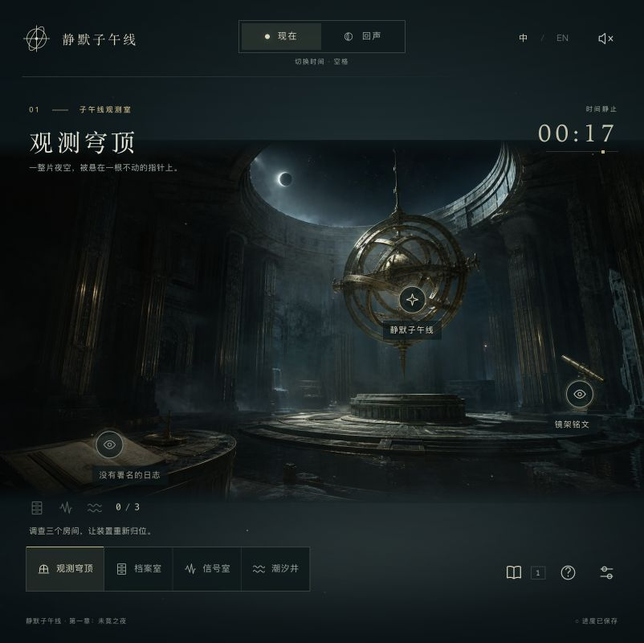

# Silent Meridian · 静默子午线

An original atmospheric browser puzzle game. Explore an observatory trapped at **00:17**, shift between the Present and its Echo, and recover the minute that never ended.

一款原创场景解谜网页游戏。在停在 **00:17** 的观测站里，切换“现在”与“回声”，让不同房间中的线索彼此解释。



- Four illustrated rooms: the dome, archive, signal room, and tidal well.
- Three interlocking puzzles and a final meridian instrument. Every puzzle has a logical solution supported by discoverable evidence.
- Two time states, a bilingual evidence journal, personal notes, three levels of optional hints, and two ending choices.
- Chinese and English throughout. Language can be changed without losing progress.
- Local autosave, keyboard and touch controls, reduced-motion support, optional synthesized ambient audio.
- Static HTML/CSS/JavaScript. No account, backend, API key, CDN, or runtime dependencies.

## Run locally

Node.js 22 is used for the small local server and build scripts.

```sh
npm run dev
```

Open [localhost:4188](http://localhost:4188). Use `PORT=4189 npm run dev` if that port is occupied.

## Controls

Click or tap glowing objects to inspect them. Use the bottom navigation to move between rooms and the phase switch to change time. **Space** shifts time when focus is on the scene, **J** opens the journal, and **Esc** closes a dialog or opens settings. Focused buttons also support standard keyboard activation.

The journal keeps collected evidence and your own deductions. Puzzle panels provide access to relevant evidence and optional hints. No audio puzzle requires hearing: tuning values and waveforms are visible.

Progress saves in this browser’s local storage after each change. A different browser, domain, or port has a separate save. Settings → Begin again asks before clearing progress. No data is transmitted to a server.

## Build and deploy

```sh
npm test
npm run build
npm run preview
```

Publish the contents of `dist/` to any static host. For Vercel, import this repository with its root directory unchanged; `vercel.json` sets `npm run build` and output directory `dist`. No environment variables are required. All asset paths are relative, so the build also works under a GitHub Pages project subdirectory.

## Project layout

```text
src/app.js        Browser UI, interactions and keyboard controls
src/game.js       Puzzle rules and validated save state
src/content.js    Chinese and English story, clues and interface copy
src/audio.js      Optional audio synthesized in the browser
src/style.css    Responsive visual design
assets/          Local scene art and icon
tests/           Puzzle uniqueness, reachability, progression and save tests
docs/            Original design, solutions and art provenance
```

The story, puzzle connections, and implementation were created for this project. Scene backgrounds were generated specifically for it without reference images. See [art provenance](docs/ART.md) and [puzzle design and solutions](docs/DESIGN.md) (spoilers).

## 中文说明

四个房间、两种时间状态、三组关联谜题与最终星盘，组成一个可以完整通关的章节。三层提示可以逐步展开；潮汐机关的最后一层提示会根据当前刻度计算解法。所有机关都能复位，错误尝试不会丢失线索。

本项目是独立游戏，运行代码与素材均位于自己的目录。默认服务端口为 `4188`。部署 Vercel 使用 `npm run build`，输出目录为 `dist`。

## License

Code and project content are provided under [MIT](LICENSE). Generated artwork provenance is documented in `docs/ART.md`.
