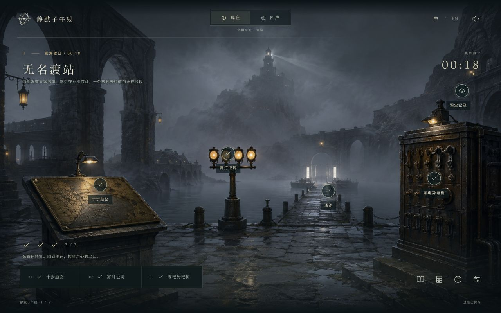

# Silent Meridian · 静默子午线

An original atmospheric browser puzzle game in **four playable chapters with thirteen puzzles**. Begin at an observatory trapped at **00:17**, cross a nameless ferry terminal, descend into a glass conservatory, and reach the zeroth lighthouse. Shift between the Present and its Echo to recover the minute that never ended.

一款原创场景解谜网页游戏，包含 **四个可通关章节、十三道谜题**。从停在 **00:17** 的观测站出发，穿过无名渡站、玻璃温室，抵达第零座灯塔；在“现在”与“回声”中拼回完整的时间。


- Seven original illustrated scenes across four chapters. The opening chapter retains its four freely explorable rooms.
- Thirteen puzzles: ordering, frequencies, coupled tide gears, meridian alignment, constrained navigation, truth and lies, electrical toggles, mirror tracing, cultivation programs, specimen constraints, causality, layered shadows, and a final coordinate synthesis.
- Sequential chapter unlocks, a chapter directory, independent progress, carried evidence, and revisits. The opening chapter’s choice is remembered in both final endings.
- Two time states, a bilingual evidence journal, personal notes, and three levels of optional hints. Tide and electrical-bridge hints adapt to the current state.
- Chinese and English throughout. Language can be changed without losing progress.
- Local autosave, keyboard and touch controls, reduced-motion support, optional synthesized ambient audio.
- Static HTML/CSS/JavaScript. No account, backend, API key, CDN, or runtime dependencies.



## Run locally

Node.js 22 is used for the small local server and build scripts.

```sh
npm run dev
```

Open [localhost:4188](http://localhost:4188). Use `PORT=4189 npm run dev` if that port is occupied.

## Controls

Click or tap glowing objects to inspect them. The bottom navigation changes rooms in chapter I and opens mechanisms in chapters II–IV. Inspect each new location’s record in both time states. **Space** shifts time when focus is on the scene, **J** opens the journal, and **Esc** closes a dialog or opens settings. Focused buttons also support standard keyboard activation.

The journal keeps collected evidence and your own deductions. Puzzle panels provide access to relevant evidence and optional hints. No audio puzzle requires hearing: tuning values and waveforms are visible.

Progress saves in this browser’s local storage after each change. A different browser, domain, or port has a separate save. The original version-one save migrates automatically, preserving first-chapter puzzles, notes, preferences, and the ending. **Chapters** switches locations without clearing progress. Settings → Begin again asks before clearing all four chapters. No data is transmitted to a server.

## Chapters

| Chapter | Location | Puzzles |
| --- | --- | --- |
| I · The Unfinished Night / 未竟之夜 | Observatory, four rooms | 4 linked instruments |
| II · The Nameless Ferry / 无名渡站 | A terminal in the fog | Ten-move crossing, lamps’ testimony, zero-potential bridge |
| III · The Glass Conservatory / 玻璃温室 | A garden beneath the sea | Six mirrors, five cultivation cycles, specimen cabinet |
| IV · The Zeroth Lighthouse / 第零座灯塔 | The beginning of the coast | Causal archive, three shutters, coordinates of the origin |

## Build and deploy

```sh
npm test
npm run build
npm run preview
```

Publish the contents of `dist/` to any static host. For Vercel, import this repository with its root directory unchanged; `vercel.json` sets `npm run build` and output directory `dist`. No environment variables are required. All asset paths are relative, so the build also works under a GitHub Pages project subdirectory.

## Project layout

```text
src/app.js        Browser UI, interactions and keyboard controls
src/game.js       Puzzle rules and validated save state
src/content.js    Chinese and English story, clues and interface copy
src/campaign.js   New puzzle engines, chapter gates and save validation
src/chapters.js   Bilingual chapter stories, evidence and hints
src/expedition.js Chapter scenes, mechanisms, journal and endings
src/audio.js      Optional audio synthesized in the browser
src/style.css    Responsive visual design
assets/          Local scene art and icon
tests/           Puzzle uniqueness, reachability, progression and save tests
docs/            Original design, solutions and art provenance
```

The story, puzzle connections, and implementation were created for this project. Scene backgrounds were generated specifically for it without reference images. See [art provenance](docs/ART.md) and [puzzle design and solutions](docs/DESIGN.md) (spoilers).

## 中文说明

现在共有四章、十三道谜题。完成上一章后，下一章会解锁；标题画面和游戏内都有章节目录。切换章节会保留每章的进度，前面章节的关键结果也会收进随身记录，供终章使用。

现有第一章存档会自动保留。所有未完成的机关都能复位；错误尝试不会丢失线索。三层提示可以逐步展开，潮汐与电桥的最后一层提示会根据当前状态计算解法。游戏全程支持中英文。

本项目是独立游戏，运行代码与素材均位于自己的目录。默认服务端口为 `4188`。部署 Vercel 使用 `npm run build`，输出目录为 `dist`。

## License

Code and project content are provided under [MIT](LICENSE). Generated artwork provenance is documented in `docs/ART.md`.
